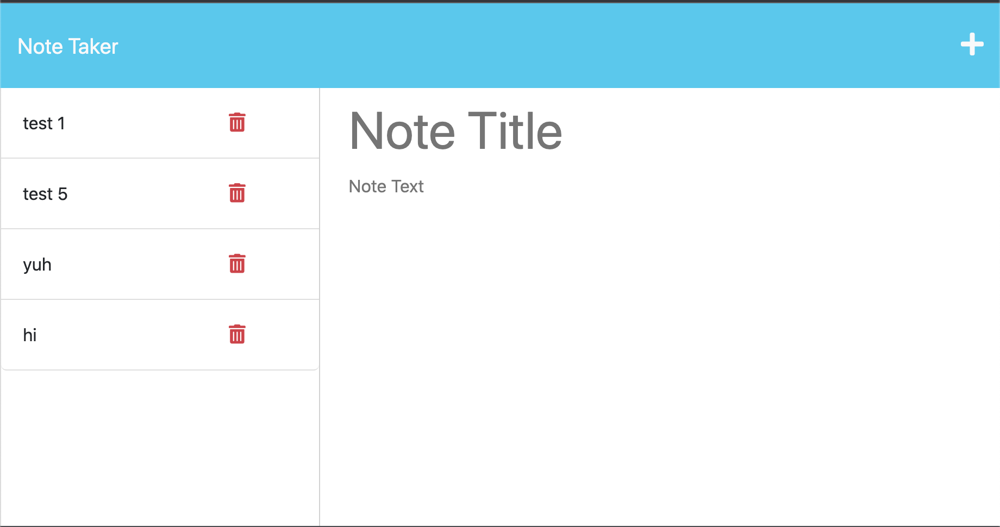

# Note Taker 

## Description 

The Note Taker App is a simple and intuitive application that allows users to create, save, and manage their notes effectively. With its user-friendly interface, the app provides a seamless note-taking experience for users.

 

 [Link to HEROKU deployment](https://drive.google.com/file/d/1Cp7M5bnhzL9RQsuyeFV9hDPOjrKwckQH/view)

## Table of contents:

* Title
* Description
* Installation
* Usage
* Author
* GitHub Link
* License

## Installation:

```
* download source code * 
* run *  
"node server.js" on your localhost
```


## Usage
```
1. Landing Page: Upon opening the app, users are greeted with a visually appealing landing page that provides a clear and easy-to-use interface.

Notes Page: Clicking on the provided link takes users to the notes page. Here, they can view their existing notes listed in the left-hand column. On the right-hand side, there are convenient empty fields where users can enter the title and text of a new note.

Save Functionality: As users enter a new note title and its corresponding text, a Save icon dynamically appears in the navigation bar at the top of the page. This feature ensures that users can easily save their notes with a single click.

Note Management: When a user saves a note, it is instantly added to the left-hand column alongside their existing notes. This allows for seamless organization and retrieval of notes whenever needed.

Note Selection: Users can effortlessly select any existing note from the list in the left-hand column. Once selected, the note's content is displayed in the right-hand column, providing a focused and distraction-free reading experience.

Create New Note: To create a new note, users can simply click on the Write icon in the navigation bar. This action clears the previous note selection and provides fresh, empty fields to enter a new note title and text.
```

###

Written by Christian Alteri

To learn more about my project, [click here](https://github.com/ChristianAlteri/Note-Taker).

## How to Contribute

Download the source code and add functionality. Request to merge onto Master dev branch


####


[](LICENSE)

